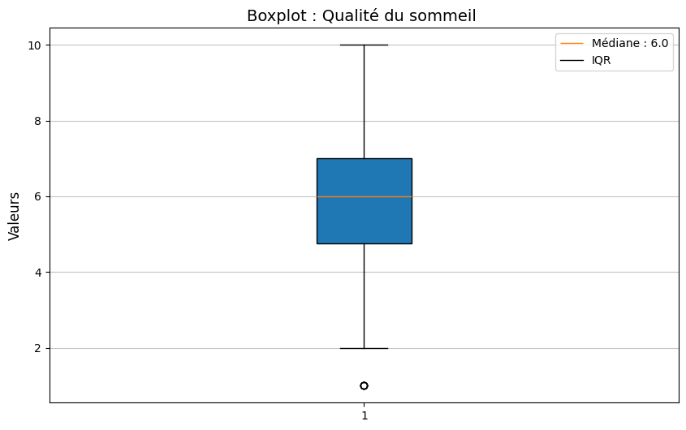
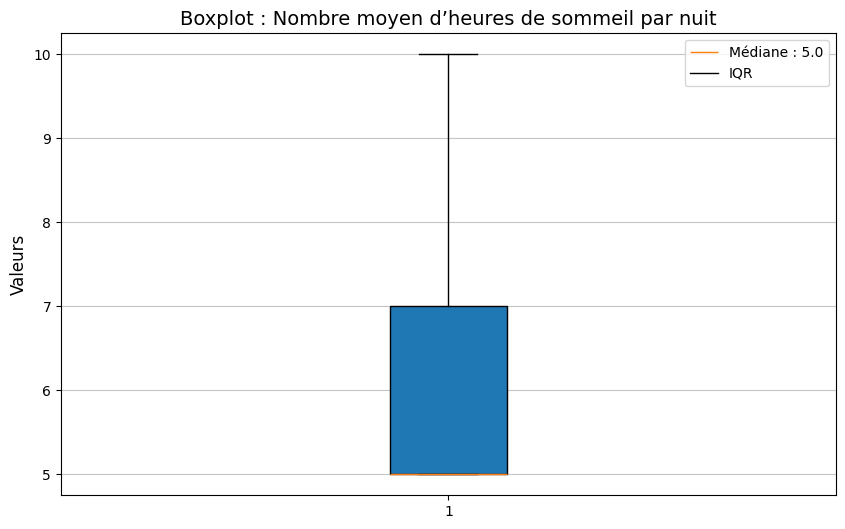
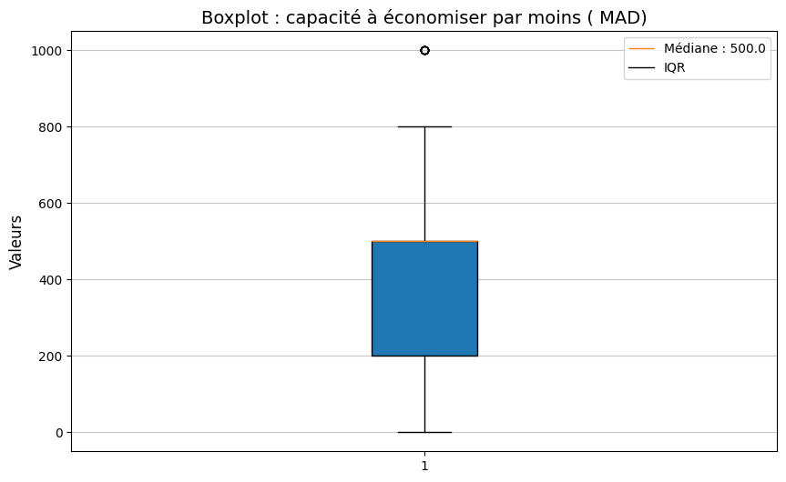
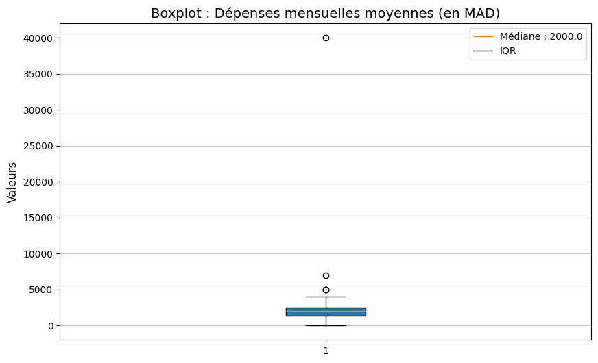
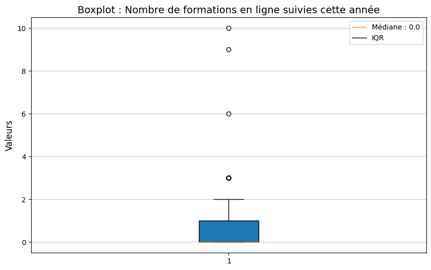
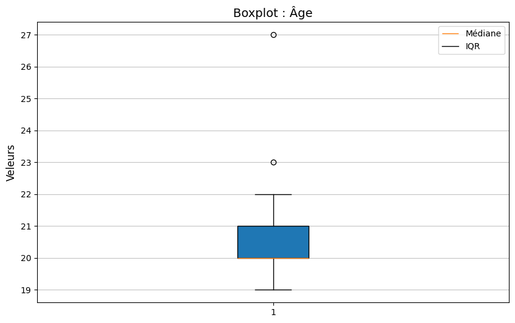

# Analyse des données - Généré le 18/04/2025 à 21:55

#### Genre [GENRE]

|          |         | Fréquence | Pourcentage | Pourcentage valide | Pourcentage cumulé |
| -------- | ------- | --------- | ----------- | ------------------ | ------------------ |
| Valide   | FEMALE  | 80        | 68.97%      | 68.97%             | 68.97%             |
|          | MALE    | 36        | 31.03%      | 31.03%             | 100.00%            |
|          | Total   | 116       | 100.00%     | 100.00%            |                    |
| Manquant | Système | 0         | 0.00%       |                    |                    |
| Total    |         | 116       | 100.00%     |                    |                    |

#### Type d’application la plus utilisée  [TDLPU]

|          |                 | Fréquence | Pourcentage | Pourcentage valide | Pourcentage cumulé |
| -------- | --------------- | --------- | ----------- | ------------------ | ------------------ |
| Valide   | RESEAUX SOCIAUX | 109       | 72.67%      | 72.67%             | 72.67%             |
|          | BUREAUTIQUE     | 12        | 8.00%       | 8.00%              | 80.67%             |
|          | JEUX VIDEO      | 16        | 10.67%      | 10.67%             | 91.33%             |
|          | STREAMING       | 10        | 6.67%       | 6.67%              | 98.00%             |
|          | YOUTUBE         | 2         | 1.33%       | 1.33%              | 99.33%             |
|          | LES SERIES      | 1         | 0.67%       | 0.67%              | 100.00%            |
|          | Total           | 150       | 100.00%     | 100.00%            |                    |
| Manquant | Système         | 0         | 0.00%       |                    |                    |
| Total    |                 | 150       | 100.00%     |                    |                    |

#### Pratique du multitâche lors des études [PDMLDE]

|          |         | Fréquence | Pourcentage | Pourcentage valide | Pourcentage cumulé |
| -------- | ------- | --------- | ----------- | ------------------ | ------------------ |
| Valide   | OUI     | 66        | 56.90%      | 56.90%             | 56.90%             |
|          | NON     | 50        | 43.10%      | 43.10%             | 100.00%            |
|          | Total   | 116       | 100.00%     | 100.00%            |                    |
| Manquant | Système | 0         | 0.00%       |                    |                    |
| Total    |         | 116       | 100.00%     |                    |                    |

#### Fréquence d’utilisation des réseaux sociaux par jour [FDDRSPJ]

|          |         | Fréquence | Pourcentage | Pourcentage valide | Pourcentage cumulé |
| -------- | ------- | --------- | ----------- | ------------------ | ------------------ |
| Valide   | 7 ET +  | 29        | 25.00%      | 25.00%             | 25.00%             |
|          | 4-6     | 43        | 37.07%      | 37.07%             | 62.07%             |
|          | 1-3     | 41        | 35.34%      | 35.34%             | 97.41%             |
|          | 1       | 3         | 2.59%       | 2.59%              | 100.00%            |
|          | Total   | 116       | 100.00%     | 100.00%            |                    |
| Manquant | Système | 0         | 0.00%       |                    |                    |
| Total    |         | 116       | 100.00%     |                    |                    |

#### Qualité du sommeil  [QDS]

|          |         | Fréquence | Pourcentage | Pourcentage valide | Pourcentage cumulé |
| -------- | ------- | --------- | ----------- | ------------------ | ------------------ |
| Valide   | 1       | 5         | 4.31%       | 4.31%              | 4.31%              |
|          | 2       | 4         | 3.45%       | 3.45%              | 7.76%              |
|          | 3       | 9         | 7.76%       | 7.76%              | 15.52%             |
|          | 4       | 11        | 9.48%       | 9.48%              | 25.00%             |
|          | 5       | 21        | 18.10%      | 18.10%             | 43.10%             |
|          | 6       | 16        | 13.79%      | 13.79%             | 56.90%             |
|          | 7       | 22        | 18.97%      | 18.97%             | 75.86%             |
|          | 8       | 13        | 11.21%      | 11.21%             | 87.07%             |
|          | 9       | 5         | 4.31%       | 4.31%              | 91.38%             |
|          | 10      | 10        | 8.62%       | 8.62%              | 100.00%            |
|          | Total   | 116       | 100.00%     | 100.00%            |                    |
| Manquant | Système | 0         | 0.00%       |                    |                    |
| Total    |         | 116       | 100.00%     |                    |                    |

#### •Nombre de livres lus par an [NDLLPA]

|          |            | Fréquence | Pourcentage | Pourcentage valide | Pourcentage cumulé |
| -------- | ---------- | --------- | ----------- | ------------------ | ------------------ |
| Valide   | 1-5        | 65        | 56.03%      | 56.03%             | 56.03%             |
|          | 5-10       | 7         | 6.03%       | 6.03%              | 62.07%             |
|          | MOINS DE 1 | 32        | 27.59%      | 27.59%             | 89.66%             |
|          | 10 ET PLUS | 9         | 7.76%       | 7.76%              | 97.41%             |
|          | AUCUN      | 2         | 1.72%       | 1.72%              | 99.14%             |
|          | 70         | 1         | 0.86%       | 0.86%              | 100.00%            |
|          | Total      | 116       | 100.00%     | 100.00%            |                    |
| Manquant | Système    | 0         | 0.00%       |                    |                    |
| Total    |            | 116       | 100.00%     |                    |                    |

#### Type de sport pratiqué [TDSP]

|          |                                           | Fréquence | Pourcentage | Pourcentage valide | Pourcentage cumulé |
| -------- | ----------------------------------------- | --------- | ----------- | ------------------ | ------------------ |
| Valide   | LA MUSCULATION                            | 17        | 12.78%      | 12.98%             | 12.98%             |
|          | KARATÉ                                    | 3         | 2.26%       | 2.29%              | 15.27%             |
|          | ATHLÉTISME                                | 2         | 1.50%       | 1.53%              | 16.79%             |
|          | AUCUN                                     | 11        | 8.27%       | 8.40%              | 25.19%             |
|          | VOLEY BALL                                | 1         | 0.75%       | 0.76%              | 25.95%             |
|          | GYM                                       | 6         | 4.51%       | 4.58%              | 30.53%             |
|          | FOOTBALL                                  | 27        | 20.30%      | 20.61%             | 51.15%             |
|          | NATATION                                  | 10        | 7.52%       | 7.63%              | 58.78%             |
|          | LA MARCHE                                 | 16        | 12.03%      | 12.21%             | 70.99%             |
|          | FITNESS                                   | 2         | 1.50%       | 1.53%              | 72.52%             |
|          | L'ANNÉE DERNIÈRE J'AI FAIT DU VOLLEY-BALL | 1         | 0.75%       | 0.76%              | 73.28%             |
|          | D'AUTRES...                               | 1         | 0.75%       | 0.76%              | 74.05%             |
|          | JUSTE MARCHER                             | 1         | 0.75%       | 0.76%              | 74.81%             |
|          | TENNIS                                    | 3         | 2.26%       | 2.29%              | 77.10%             |
|          | COURSE À PIED                             | 8         | 6.02%       | 6.11%              | 83.21%             |
|          | AIEROBIC                                  | 1         | 0.75%       | 0.76%              | 83.97%             |
|          | ZOMBA                                     | 1         | 0.75%       | 0.76%              | 84.73%             |
|          | BOXING                                    | 2         | 1.50%       | 1.53%              | 86.26%             |
|          | TECKWANDO                                 | 2         | 1.50%       | 1.53%              | 87.79%             |
|          | PILATES                                   | 1         | 0.75%       | 0.76%              | 88.55%             |
|          | E-SPORT                                   | 1         | 0.75%       | 0.76%              | 89.31%             |
|          | LA DANSE                                  | 1         | 0.75%       | 0.76%              | 90.08%             |
|          | DANCE                                     | 1         | 0.75%       | 0.76%              | 90.84%             |
|          | LA BOXE                                   | 1         | 0.75%       | 0.76%              | 91.60%             |
|          | LES SPORT PHYSIQUE                        | 1         | 0.75%       | 0.76%              | 92.37%             |
|          | EN COURS D'EXÉCUTION                      | 1         | 0.75%       | 0.76%              | 93.13%             |
|          | CARDIO                                    | 1         | 0.75%       | 0.76%              | 93.89%             |
|          | BASKET-BALL                               | 2         | 1.50%       | 1.53%              | 95.42%             |
|          | YOGA                                      | 1         | 0.75%       | 0.76%              | 96.18%             |
|          | COLLECTIF                                 | 1         | 0.75%       | 0.76%              | 96.95%             |
|          | BASKET                                    | 1         | 0.75%       | 0.76%              | 97.71%             |
|          | KANG-FU                                   | 1         | 0.75%       | 0.76%              | 98.47%             |
|          | LA COURSE                                 | 1         | 0.75%       | 0.76%              | 99.24%             |
|          | BASCKET BALL                              | 1         | 0.75%       | 0.76%              | 100.00%            |
|          | Total                                     | 131       | 98.50%      | 100.00%            |                    |
| Manquant | Système                                   | 2         | 1.50%       |                    |                    |
| Total    |                                           | 133       | 100.00%     |                    |                    |

> Les valeurs non valides sont les suivantes : `0`, `_`

#### Loisir préféré [LP]

|          |                                                      | Fréquence | Pourcentage | Pourcentage valide | Pourcentage cumulé |
| -------- | ---------------------------------------------------- | --------- | ----------- | ------------------ | ------------------ |
| Valide   | LE SPORT                                             | 1         | 0.71%       | 0.72%              | 0.72%              |
|          | DECOUVRIR NOUVEAU CHOSES                             | 1         | 0.71%       | 0.72%              | 1.45%              |
|          | MUSIQUE                                              | 4         | 2.86%       | 2.90%              | 4.35%              |
|          | LECTURE                                              | 12        | 8.57%       | 8.70%              | 13.04%             |
|          | RIEN                                                 | 3         | 2.14%       | 2.17%              | 15.22%             |
|          | BRODERIE                                             | 1         | 0.71%       | 0.72%              | 15.94%             |
|          | CREATION DE CONTENU                                  | 1         | 0.71%       | 0.72%              | 16.67%             |
|          | FOOTBALL                                             | 6         | 4.29%       | 4.35%              | 21.01%             |
|          | ART                                                  | 1         | 0.71%       | 0.72%              | 21.74%             |
|          | LA LECTURE                                           | 6         | 4.29%       | 4.35%              | 26.09%             |
|          | NATATION                                             | 11        | 7.86%       | 7.97%              | 34.06%             |
|          | LECTEUR                                              | 1         | 0.71%       | 0.72%              | 34.78%             |
|          | COOKING                                              | 1         | 0.71%       | 0.72%              | 35.51%             |
|          | APPRENTISSAGES DES LANGUE                            | 1         | 0.71%       | 0.72%              | 36.23%             |
|          | NETWORKING                                           | 1         | 0.71%       | 0.72%              | 36.96%             |
|          | CONDUIRE LA VOITURE                                  | 1         | 0.71%       | 0.72%              | 37.68%             |
|          | SURF                                                 | 2         | 1.43%       | 1.45%              | 39.13%             |
|          | DESSIN                                               | 6         | 4.29%       | 4.35%              | 43.48%             |
|          | LA DANSE                                             | 2         | 1.43%       | 1.45%              | 44.93%             |
|          | PODCAST                                              | 1         | 0.71%       | 0.72%              | 45.65%             |
|          | SERIE                                                | 1         | 0.71%       | 0.72%              | 46.38%             |
|          | PHOTOGRAPHIE                                         | 1         | 0.71%       | 0.72%              | 47.10%             |
|          | LIRE DES ROMANS ARABES                               | 1         | 0.71%       | 0.72%              | 47.83%             |
|          | REGARDER DES FILMS                                   | 1         | 0.71%       | 0.72%              | 48.55%             |
|          | DESSINER UN PEU                                      | 1         | 0.71%       | 0.72%              | 49.28%             |
|          | MONTER DES VIDEOS.                                   | 1         | 0.71%       | 0.72%              | 50.00%             |
|          | DESSINER                                             | 2         | 1.43%       | 1.45%              | 51.45%             |
|          | CUISINE                                              | 3         | 2.14%       | 2.17%              | 53.62%             |
|          | EQUITATION                                           | 3         | 2.14%       | 2.17%              | 55.80%             |
|          | PHOTOGRAPHE                                          | 1         | 0.71%       | 0.72%              | 56.52%             |
|          | LE SPORT(FITNESS)                                    | 1         | 0.71%       | 0.72%              | 57.25%             |
|          | PEINTURE                                             | 1         | 0.71%       | 0.72%              | 57.97%             |
|          | SPORT                                                | 11        | 7.86%       | 7.97%              | 65.94%             |
|          | LA NATATION                                          | 2         | 1.43%       | 1.45%              | 67.39%             |
|          | JEUX VIDEO                                           | 3         | 2.14%       | 2.17%              | 69.57%             |
|          | LECTUR                                               | 1         | 0.71%       | 0.72%              | 70.29%             |
|          | GYM                                                  | 2         | 1.43%       | 1.45%              | 71.74%             |
|          | CALIGRAPHIE                                          | 1         | 0.71%       | 0.72%              | 72.46%             |
|          | COURSE                                               | 1         | 0.71%       | 0.72%              | 73.19%             |
|          | FOUTBALL                                             | 1         | 0.71%       | 0.72%              | 73.91%             |
|          | REGARDER DES SERIES OU DES FILM                      | 1         | 0.71%       | 0.72%              | 74.64%             |
|          | CHANT                                                | 1         | 0.71%       | 0.72%              | 75.36%             |
|          | CROCHET                                              | 1         | 0.71%       | 0.72%              | 76.09%             |
|          | APPRENDRE DES NOUVEAUX COMPETENCES OU BIEN TECHNIQUE | 1         | 0.71%       | 0.72%              | 76.81%             |
|          | REGARDER DES SERIE...                                | 1         | 0.71%       | 0.72%              | 77.54%             |
|          | PRATIQUER DU SPORT                                   | 1         | 0.71%       | 0.72%              | 78.26%             |
|          | POWER LIFTING                                        | 1         | 0.71%       | 0.72%              | 78.99%             |
|          | CALISTHENICS                                         | 1         | 0.71%       | 0.72%              | 79.71%             |
|          | MEDITATION                                           | 1         | 0.71%       | 0.72%              | 80.43%             |
|          | DANCE                                                | 2         | 1.43%       | 1.45%              | 81.88%             |
|          | LA DENSE                                             | 1         | 0.71%       | 0.72%              | 82.61%             |
|          | JEUX VIDEOS                                          | 1         | 0.71%       | 0.72%              | 83.33%             |
|          | VOYAGE                                               | 4         | 2.86%       | 2.90%              | 86.23%             |
|          | DESSIN-FOOT                                          | 1         | 0.71%       | 0.72%              | 86.96%             |
|          | PROGRAMMER DES LOGICIELS                             | 1         | 0.71%       | 0.72%              | 87.68%             |
|          | VIDEOGRAPHIE                                         | 1         | 0.71%       | 0.72%              | 88.41%             |
|          | MUSCULATION                                          | 2         | 1.43%       | 1.45%              | 89.86%             |
|          | CHESS                                                | 2         | 1.43%       | 1.45%              | 91.30%             |
|          | DORMIR                                               | 2         | 1.43%       | 1.45%              | 92.75%             |
|          | SORTIES                                              | 1         | 0.71%       | 0.72%              | 93.48%             |
|          | VOYAGES                                              | 1         | 0.71%       | 0.72%              | 94.20%             |
|          | SHOPPING                                             | 1         | 0.71%       | 0.72%              | 94.93%             |
|          | APPRENDRE A JOUER LES INSTRUMENTS DE MUSIQUE         | 1         | 0.71%       | 0.72%              | 95.65%             |
|          | LA MARCHE                                            | 1         | 0.71%       | 0.72%              | 96.38%             |
|          | DANSE                                                | 1         | 0.71%       | 0.72%              | 97.10%             |
|          | LIRE                                                 | 1         | 0.71%       | 0.72%              | 97.83%             |
|          | GUITAR - MODELING                                    | 1         | 0.71%       | 0.72%              | 98.55%             |
|          | THEATRE                                              | 1         | 0.71%       | 0.72%              | 99.28%             |
|          | REGARDER DES SERIES                                  | 1         | 0.71%       | 0.72%              | 100.00%            |
|          | Total                                                | 138       | 98.57%      | 100.00%            |                    |
| Manquant | Système                                              | 2         | 1.43%       |                    |                    |
| Total    |                                                      | 140       | 100.00%     |                    |                    |

> Les valeurs non valides sont les suivantes : `.`, `0`

#### •Travail en parallèle des études [TEPDE]

|          |         | Fréquence | Pourcentage | Pourcentage valide | Pourcentage cumulé |
| -------- | ------- | --------- | ----------- | ------------------ | ------------------ |
| Valide   | NON     | 93        | 80.17%      | 80.17%             | 80.17%             |
|          | OUI     | 23        | 19.83%      | 19.83%             | 100.00%            |
|          | Total   | 116       | 100.00%     | 100.00%            |                    |
| Manquant | Système | 0         | 0.00%       |                    |                    |
| Total    |         | 116       | 100.00%     |                    |                    |

#### Option    Bac [OB]

|          |         | Fréquence | Pourcentage | Pourcentage valide | Pourcentage cumulé |
| -------- | ------- | --------- | ----------- | ------------------ | ------------------ |
| Valide   | MATH    | 13        | 11.21%      | 11.21%             | 11.21%             |
|          | EXP     | 27        | 23.28%      | 23.28%             | 34.48%             |
|          | ECO     | 76        | 65.52%      | 65.52%             | 100.00%            |
|          | Total   | 116       | 100.00%     | 100.00%            |                    |
| Manquant | Système | 0         | 0.00%       |                    |                    |
| Total    |         | 116       | 100.00%     |                    |                    |

#### Nombre d’heures passées sur YouTube, Netflix par semaine [NDPSYNPS]

|          |             | Fréquence | Pourcentage | Pourcentage valide | Pourcentage cumulé |
| -------- | ----------- | --------- | ----------- | ------------------ | ------------------ |
| Valide   | 5H ET PLUS  | 29        | 25.00%      | 25.00%             | 25.00%             |
|          | 3-5H        | 22        | 18.97%      | 18.97%             | 43.97%             |
|          | 1-3H        | 38        | 32.76%      | 32.76%             | 76.72%             |
|          | MOINS DE 1H | 27        | 23.28%      | 23.28%             | 100.00%            |
|          | Total       | 116       | 100.00%     | 100.00%            |                    |
| Manquant | Système     | 0         | 0.00%       |                    |                    |
| Total    |             | 116       | 100.00%     |                    |                    |

#### Nombre moyen d’heures de sommeil par nuit [NMDDSPN]

|          |         | Fréquence | Pourcentage | Pourcentage valide | Pourcentage cumulé |
| -------- | ------- | --------- | ----------- | ------------------ | ------------------ |
| Valide   | 10      | 4         | 3.42%       | 3.45%              | 3.45%              |
|          | 5       | 84        | 71.79%      | 72.41%             | 75.86%             |
|          | 7       | 27        | 23.08%      | 23.28%             | 99.14%             |
|          | Total   | 116       | 98.29%      | 99.14%             |                    |
| Manquant | Système | 1         | 0.85%       |                    |                    |
| Total    |         | 117       | 99.14%      |                    |                    |

> Les valeurs non valides sont les suivantes : `Je ne sais pas`

#### Mention Bac [MB]

|          |          | Fréquence | Pourcentage | Pourcentage valide | Pourcentage cumulé |
| -------- | -------- | --------- | ----------- | ------------------ | ------------------ |
| Valide   | PASSABLE | 8         | 6.90%       | 6.90%              | 6.90%              |
|          | BIEN     | 59        | 50.86%      | 50.86%             | 57.76%             |
|          | T. BIEN  | 24        | 20.69%      | 20.69%             | 78.45%             |
|          | A BIEN   | 25        | 21.55%      | 21.55%             | 100.00%            |
|          | Total    | 116       | 100.00%     | 100.00%            |                    |
| Manquant | Système  | 0         | 0.00%       |                    |                    |
| Total    |          | 116       | 100.00%     |                    |                    |

#### Nombre d’heures de travail par semaine [NDDTPS]

|          |         | Fréquence | Pourcentage | Pourcentage valide | Pourcentage cumulé |
| -------- | ------- | --------- | ----------- | ------------------ | ------------------ |
| Valide   | 0       | 39        | 33.33%      | 33.62%             | 33.62%             |
|          | 10      | 70        | 59.83%      | 60.34%             | 93.97%             |
|          | 20      | 6         | 5.13%       | 5.17%              | 99.14%             |
|          | Total   | 116       | 98.29%      | 99.14%             |                    |
| Manquant | Système | 1         | 0.85%       |                    |                    |
| Total    |         | 117       | 99.14%      |                    |                    |

> Les valeurs non valides sont les suivantes : `??`

#### •Combien de fois vous voyager ( entre Dakhla et votre Ville ) par ans [CDFVVPA]

|          |         | Fréquence | Pourcentage | Pourcentage valide | Pourcentage cumulé |
| -------- | ------- | --------- | ----------- | ------------------ | ------------------ |
| Valide   | 0       | 3         | 2.50%       | 2.59%              | 2.59%              |
|          | 1       | 12        | 10.00%      | 10.34%             | 12.93%             |
|          | 2       | 48        | 40.00%      | 41.38%             | 54.31%             |
|          | 4       | 28        | 23.33%      | 24.14%             | 78.45%             |
|          | 3       | 1         | 0.83%       | 0.86%              | 79.31%             |
|          | 6       | 20        | 16.67%      | 17.24%             | 96.55%             |
|          | Total   | 116       | 93.33%      | 96.55%             |                    |
| Manquant | Système | 4         | 3.33%       |                    |                    |
| Total    |         | 120       | 96.55%      |                    |                    |

> Les valeurs non valides sont les suivantes : `MON ORIGINE C’EST DAKHLA`, `UNE SEULE FOIS`, `MA VILLE EST DAKHLA `, `SA DÉPEND LES CONDITIONS`

#### Temps passé sur les écrans par jour  [TPSLEPJ]

|          |             | Fréquence | Pourcentage | Pourcentage valide | Pourcentage cumulé |
| -------- | ----------- | --------- | ----------- | ------------------ | ------------------ |
| Valide   | 5H ET PLUS  | 38        | 32.76%      | 32.76%             | 32.76%             |
|          | 3-5H        | 49        | 42.24%      | 42.24%             | 75.00%             |
|          | 1-3H        | 25        | 21.55%      | 21.55%             | 96.55%             |
|          | MOINS DE 1H | 4         | 3.45%       | 3.45%              | 100.00%            |
|          | Total       | 116       | 100.00%     | 100.00%            |                    |
| Manquant | Système     | 0         | 0.00%       |                    |                    |
| Total    |             | 116       | 100.00%     |                    |                    |

#### Moyen de voyage Utiliser  [MDVU]

|          |          | Fréquence | Pourcentage | Pourcentage valide | Pourcentage cumulé |
| -------- | -------- | --------- | ----------- | ------------------ | ------------------ |
| Valide   | AVION    | 63        | 52.50%      | 52.94%             | 52.94%             |
|          | AUTOCARE | 33        | 27.50%      | 27.73%             | 80.67%             |
|          | AUCUN    | 2         | 1.67%       | 1.68%              | 82.35%             |
|          | VOITURE  | 18        | 15.00%      | 15.13%             | 97.48%             |
|          | TRAIN    | 1         | 0.83%       | 0.84%              | 98.32%             |
|          | TAXI     | 2         | 1.67%       | 1.68%              | 100.00%            |
|          | Total    | 119       | 99.17%      | 100.00%            |                    |
| Manquant | Système  | 1         | 0.83%       |                    |                    |
| Total    |          | 120       | 100.00%     |                    |                    |

> Les valeurs non valides sont les suivantes : `.`

#### capacité à économiser par moins ( MAD) [CAEPM]

|          |         | Fréquence | Pourcentage | Pourcentage valide | Pourcentage cumulé |
| -------- | ------- | --------- | ----------- | ------------------ | ------------------ |
| Valide   | 0       | 19        | 15.57%      | 16.38%             | 16.38%             |
|          | 800     | 1         | 0.82%       | 0.86%              | 17.24%             |
|          | 100     | 5         | 4.10%       | 4.31%              | 21.55%             |
|          | 1000    | 8         | 6.56%       | 6.90%              | 28.45%             |
|          | 200     | 13        | 10.66%      | 11.21%             | 39.66%             |
|          | 300     | 5         | 4.10%       | 4.31%              | 43.97%             |
|          | 500     | 57        | 46.72%      | 49.14%             | 93.10%             |
|          | 20      | 1         | 0.82%       | 0.86%              | 93.97%             |
|          | 150     | 1         | 0.82%       | 0.86%              | 94.83%             |
|          | Total   | 116       | 90.16%      | 94.83%             |                    |
| Manquant | Système | 6         | 4.92%       |                    |                    |
| Total    |         | 122       | 94.83%      |                    |                    |

> Les valeurs non valides sont les suivantes : `Rien`, `Aucun`, `Aucun`, `Rien`, `rien`, `pas d'économie`

#### Ville d’origine [VD]

|          |                                      | Fréquence | Pourcentage | Pourcentage valide | Pourcentage cumulé |
| -------- | ------------------------------------ | --------- | ----------- | ------------------ | ------------------ |
| Valide   | KENITRA                              | 2         | 1.72%       | 1.72%              | 1.72%              |
|          | AGADIR                               | 7         | 6.03%       | 6.03%              | 7.76%              |
|          | DAKHLA                               | 17        | 14.66%      | 14.66%             | 22.41%             |
|          | CASABLANCA                           | 17        | 14.66%      | 14.66%             | 37.07%             |
|          | KHEMISSET                            | 2         | 1.72%       | 1.72%              | 38.79%             |
|          | TANGER                               | 2         | 1.72%       | 1.72%              | 40.52%             |
|          | FES                                  | 6         | 5.17%       | 5.17%              | 45.69%             |
|          | RABAT                                | 3         | 2.59%       | 2.59%              | 48.28%             |
|          | MARRAKECH                            | 3         | 2.59%       | 2.59%              | 50.86%             |
|          | NADOR                                | 2         | 1.72%       | 1.72%              | 52.59%             |
|          | MEKNES                               | 7         | 6.03%       | 6.03%              | 58.62%             |
|          | OUJDA                                | 3         | 2.59%       | 2.59%              | 61.21%             |
|          | SAO TOME ET PRINCIPE (INTERNATIONAL) | 1         | 0.86%       | 0.86%              | 62.07%             |
|          | TAROUDANT                            | 1         | 0.86%       | 0.86%              | 62.93%             |
|          | BITAM                                | 1         | 0.86%       | 0.86%              | 63.79%             |
|          | ZAGORA                               | 2         | 1.72%       | 1.72%              | 65.52%             |
|          | SIDI KACEM                           | 3         | 2.59%       | 2.59%              | 68.10%             |
|          | BENI MELLAL                          | 3         | 2.59%       | 2.59%              | 70.69%             |
|          | SIDI BENNOUR                         | 1         | 0.86%       | 0.86%              | 71.55%             |
|          | ALI FQUIH BEN SALAH                  | 1         | 0.86%       | 0.86%              | 72.41%             |
|          | FNIDEQ                               | 1         | 0.86%       | 0.86%              | 73.28%             |
|          | OUARZAZATE                           | 3         | 2.59%       | 2.59%              | 75.86%             |
|          | SEFROU                               | 3         | 2.59%       | 2.59%              | 78.45%             |
|          | SALE                                 | 2         | 1.72%       | 1.72%              | 80.17%             |
|          | KELAA DES SRAGHNA                    | 2         | 1.72%       | 1.72%              | 81.90%             |
|          | TEMARA                               | 1         | 0.86%       | 0.86%              | 82.76%             |
|          | LAAYOUNE                             | 4         | 3.45%       | 3.45%              | 86.21%             |
|          | KHOURIBGA                            | 1         | 0.86%       | 0.86%              | 87.07%             |
|          | SIDI IFNI                            | 2         | 1.72%       | 1.72%              | 88.79%             |
|          | KELAAT MGOUNA                        | 1         | 0.86%       | 0.86%              | 89.66%             |
|          | SIDI SLIMANE                         | 2         | 1.72%       | 1.72%              | 91.38%             |
|          | BOUJDOUR                             | 1         | 0.86%       | 0.86%              | 92.24%             |
|          | AZROU                                | 1         | 0.86%       | 0.86%              | 93.10%             |
|          | BIOUGRA                              | 1         | 0.86%       | 0.86%              | 93.97%             |
|          | TIZNIT                               | 1         | 0.86%       | 0.86%              | 94.83%             |
|          | ESSAOUIRA                            | 1         | 0.86%       | 0.86%              | 95.69%             |
|          | DJIBOUTI                             | 1         | 0.86%       | 0.86%              | 96.55%             |
|          | TAOUNATE                             | 1         | 0.86%       | 0.86%              | 97.41%             |
|          | JORF EL MELHA                        | 1         | 0.86%       | 0.86%              | 98.28%             |
|          | GUELMIM                              | 1         | 0.86%       | 0.86%              | 99.14%             |
|          | KSAR EL KEBIR                        | 1         | 0.86%       | 0.86%              | 100.00%            |
|          | Total                                | 116       | 100.00%     | 100.00%            |                    |
| Manquant | Système                              | 0         | 0.00%       |                    |                    |
| Total    |                                      | 116       | 100.00%     |                    |                    |

#### Dépenses mensuelles moyennes (en MAD) [DMM]

|          |         | Fréquence | Pourcentage | Pourcentage valide | Pourcentage cumulé |
| -------- | ------- | --------- | ----------- | ------------------ | ------------------ |
| Valide   | 0       | 1         | 0.85%       | 0.86%              | 0.86%              |
|          | 1800    | 2         | 1.69%       | 1.72%              | 2.59%              |
|          | 5000    | 3         | 2.54%       | 2.59%              | 5.17%              |
|          | 400     | 2         | 1.69%       | 1.72%              | 6.90%              |
|          | 1300    | 1         | 0.85%       | 0.86%              | 7.76%              |
|          | 2200    | 1         | 0.85%       | 0.86%              | 8.62%              |
|          | 4000    | 2         | 1.69%       | 1.72%              | 10.34%             |
|          | 3500    | 1         | 0.85%       | 0.86%              | 11.21%             |
|          | 1200    | 3         | 2.54%       | 2.59%              | 13.79%             |
|          | 2100    | 2         | 1.69%       | 1.72%              | 15.52%             |
|          | 3000    | 8         | 6.78%       | 6.90%              | 22.41%             |
|          | 1600    | 2         | 1.69%       | 1.72%              | 24.14%             |
|          | 40000   | 1         | 0.85%       | 0.86%              | 25.00%             |
|          | 2500    | 17        | 14.41%      | 14.66%             | 39.66%             |
|          | 2250    | 1         | 0.85%       | 0.86%              | 40.52%             |
|          | 2000    | 23        | 19.49%      | 19.83%             | 60.34%             |
|          | 7000    | 1         | 0.85%       | 0.86%              | 61.21%             |
|          | 600     | 2         | 1.69%       | 1.72%              | 62.93%             |
|          | 1500    | 15        | 12.71%      | 12.93%             | 75.86%             |
|          | 350     | 1         | 0.85%       | 0.86%              | 76.72%             |
|          | 1000    | 13        | 11.02%      | 11.21%             | 87.93%             |
|          | 1900    | 2         | 1.69%       | 1.72%              | 89.66%             |
|          | 750     | 2         | 1.69%       | 1.72%              | 91.38%             |
|          | 2800    | 1         | 0.85%       | 0.86%              | 92.24%             |
|          | 500     | 4         | 3.39%       | 3.45%              | 95.69%             |
|          | 2300    | 3         | 2.54%       | 2.59%              | 98.28%             |
|          | Total   | 116       | 96.61%      | 98.28%             |                    |
| Manquant | Système | 2         | 1.69%       |                    |                    |
| Total    |         | 118       | 98.28%      |                    |                    |

> Les valeurs non valides sont les suivantes : `Rien`, `N'est précisé`

#### Nombre de formations en ligne suivies cette année [NDFELSCA]

|          |         | Fréquence | Pourcentage | Pourcentage valide | Pourcentage cumulé |
| -------- | ------- | --------- | ----------- | ------------------ | ------------------ |
| Valide   | 0       | 70        | 60.34%      | 60.34%             | 60.34%             |
|          | 1       | 21        | 18.10%      | 18.10%             | 78.45%             |
|          | 2       | 13        | 11.21%      | 11.21%             | 89.66%             |
|          | 3       | 9         | 7.76%       | 7.76%              | 97.41%             |
|          | 6       | 1         | 0.86%       | 0.86%              | 98.28%             |
|          | 9       | 1         | 0.86%       | 0.86%              | 99.14%             |
|          | 10      | 1         | 0.86%       | 0.86%              | 100.00%            |
|          | Total   | 116       | 100.00%     | 100.00%            |                    |
| Manquant | Système | 0         | 0.00%       |                    |                    |
| Total    |         | 116       | 100.00%     |                    |                    |

#### Matière préfère  [MP]

|          |                                            | Fréquence | Pourcentage | Pourcentage valide | Pourcentage cumulé |
| -------- | ------------------------------------------ | --------- | ----------- | ------------------ | ------------------ |
| Valide   | AUCUNE                                     | 1         | 0.76%       | 0.77%              | 0.77%              |
|          | EPISTEMOLOGIE                              | 1         | 0.76%       | 0.77%              | 1.54%              |
|          | COMPTABILITE                               | 34        | 25.76%      | 26.15%             | 27.69%             |
|          | FRANCAIS                                   | 2         | 1.52%       | 1.54%              | 29.23%             |
|          | GESTION DES RESSOURCES HUMAINES            | 2         | 1.52%       | 1.54%              | 30.77%             |
|          | MARKETING                                  | 13        | 9.85%       | 10.00%             | 40.77%             |
|          | TOUS LES MATIERES                          | 4         | 3.03%       | 3.08%              | 43.85%             |
|          | TOUT CE QUI EST EN RELATION D'INFORMATIQUE | 4         | 3.03%       | 3.08%              | 46.92%             |
|          | PROGRAMMATION                              | 6         | 4.55%       | 4.62%              | 51.54%             |
|          | TOUTES                                     | 1         | 0.76%       | 0.77%              | 52.31%             |
|          | COMPTA DES SOCIETES                        | 2         | 1.52%       | 1.54%              | 53.85%             |
|          | CONTROL DE GESTION                         | 3         | 2.27%       | 2.31%              | 56.15%             |
|          | GESTION BUDGETAIRE                         | 9         | 6.82%       | 6.92%              | 63.08%             |
|          | GRH                                        | 5         | 3.79%       | 3.85%              | 66.92%             |
|          | MATHEMATIQUE                               | 5         | 3.79%       | 3.85%              | 70.77%             |
|          | SCM                                        | 1         | 0.76%       | 0.77%              | 71.54%             |
|          | ADD                                        | 1         | 0.76%       | 0.77%              | 72.31%             |
|          | COMPORTEMENT DE CONSOMMATEUR               | 1         | 0.76%       | 0.77%              | 73.08%             |
|          | ANGLAIS                                    | 5         | 3.79%       | 3.85%              | 76.92%             |
|          | ETUDE DE MARCHE                            | 3         | 2.27%       | 2.31%              | 79.23%             |
|          | SUPPLY CHAIN                               | 5         | 3.79%       | 3.85%              | 83.08%             |
|          | ALGORITHMES                                | 4         | 3.03%       | 3.08%              | 86.15%             |
|          | ESPAGNOL                                   | 5         | 3.79%       | 3.85%              | 90.00%             |
|          | MARCHE DE CAPITAUX                         | 3         | 2.27%       | 2.31%              | 92.31%             |
|          | LOGISTIQUE                                 | 1         | 0.76%       | 0.77%              | 93.08%             |
|          | PROGGRAMATION WEB                          | 1         | 0.76%       | 0.77%              | 93.85%             |
|          | ANALYSE DES DONNEES                        | 2         | 1.52%       | 1.54%              | 95.38%             |
|          | TRESORERIE                                 | 2         | 1.52%       | 1.54%              | 96.92%             |
|          | INSTRUMENTS FINANCIERS                     | 1         | 0.76%       | 0.77%              | 97.69%             |
|          | ENGLISH                                    | 1         | 0.76%       | 0.77%              | 98.46%             |
|          | FISCALITE                                  | 1         | 0.76%       | 0.77%              | 99.23%             |
|          | COMPTABITE DE SOCIETE                      | 1         | 0.76%       | 0.77%              | 100.00%            |
|          | Total                                      | 130       | 98.48%      | 100.00%            |                    |
| Manquant | Système                                    | 2         | 1.52%       |                    |                    |
| Total    |                                            | 132       | 100.00%     |                    |                    |

> Les valeurs non valides sont les suivantes : `...`, `..`

#### Filière d’étude [FD]

|          |          | Fréquence | Pourcentage | Pourcentage valide | Pourcentage cumulé |
| -------- | -------- | --------- | ----------- | ------------------ | ------------------ |
| Valide   | COMMERCE | 34        | 29.31%      | 29.31%             | 29.31%             |
|          | GESTION  | 82        | 70.69%      | 70.69%             | 100.00%            |
|          | Total    | 116       | 100.00%     | 100.00%            |                    |
| Manquant | Système  | 0         | 0.00%       |                    |                    |
| Total    |          | 116       | 100.00%     |                    |                    |

#### Source principale de revenu [SPDR]

|          |                | Fréquence | Pourcentage | Pourcentage valide | Pourcentage cumulé |
| -------- | -------------- | --------- | ----------- | ------------------ | ------------------ |
| Valide   | AIDE FAMILIALE | 102       | 62.58%      | 62.96%             | 62.96%             |
|          | BOURSE         | 43        | 26.38%      | 26.54%             | 89.51%             |
|          | TRAVAIL        | 16        | 9.82%       | 9.88%              | 99.38%             |
|          | PARENTS        | 1         | 0.61%       | 0.62%              | 100.00%            |
|          | Total          | 162       | 99.39%      | 100.00%            |                    |
| Manquant | Système        | 1         | 0.61%       |                    |                    |
| Total    |                | 163       | 100.00%     |                    |                    |

> Les valeurs non valides sont les suivantes : `0`

#### Maîtrise d’autres logiciels  [MDL]

|          |          | Fréquence | Pourcentage | Pourcentage valide | Pourcentage cumulé |
| -------- | -------- | --------- | ----------- | ------------------ | ------------------ |
| Valide   | PYTHON   | 65        | 45.45%      | 45.45%             | 45.45%             |
|          | SPSS     | 5         | 3.50%       | 3.50%              | 48.95%             |
|          | POWER_BI | 4         | 2.80%       | 2.80%              | 51.75%             |
|          | AUTRE    | 48        | 33.57%      | 33.57%             | 85.31%             |
|          | R        | 21        | 14.69%      | 14.69%             | 100.00%            |
|          | Total    | 143       | 100.00%     | 100.00%            |                    |
| Manquant | Système  | 0         | 0.00%       |                    |                    |
| Total    |          | 143       | 100.00%     |                    |                    |

#### Type de logement ( à Dakhla ) [TDL]

|          |             | Fréquence | Pourcentage | Pourcentage valide | Pourcentage cumulé |
| -------- | ----------- | --------- | ----------- | ------------------ | ------------------ |
| Valide   | APPARTEMENT | 71        | 61.21%      | 61.74%             | 61.74%             |
|          | CHAMBRE     | 33        | 28.45%      | 28.70%             | 90.43%             |
|          | FAMILLE     | 4         | 3.45%       | 3.48%              | 93.91%             |
|          | MAISON      | 6         | 5.17%       | 5.22%              | 99.13%             |
|          | MINI VILLA  | 1         | 0.86%       | 0.87%              | 100.00%            |
|          | Total       | 115       | 99.14%      | 100.00%            |                    |
| Manquant | Système     | 1         | 0.86%       |                    |                    |
| Total    |             | 116       | 100.00%     |                    |                    |

> Les valeurs non valides sont les suivantes : `.`

#### Nombre d'heures d'étude par semaine  [NDDPS]

|          |         | Fréquence | Pourcentage | Pourcentage valide | Pourcentage cumulé |
| -------- | ------- | --------- | ----------- | ------------------ | ------------------ |
| Valide   | 32      | 1         | 0.80%       | 0.86%              | 0.86%              |
|          | 2       | 1         | 0.80%       | 0.86%              | 1.72%              |
|          | 5       | 17        | 13.60%      | 14.66%             | 16.38%             |
|          | 7       | 1         | 0.80%       | 0.86%              | 17.24%             |
|          | 10      | 11        | 8.80%       | 9.48%              | 26.72%             |
|          | 15      | 16        | 12.80%      | 13.79%             | 40.52%             |
|          | 20      | 46        | 36.80%      | 39.66%             | 80.17%             |
|          | 23      | 4         | 3.20%       | 3.45%              | 83.62%             |
|          | 25      | 1         | 0.80%       | 0.86%              | 84.48%             |
|          | 26      | 1         | 0.80%       | 0.86%              | 85.34%             |
|          | 27      | 1         | 0.80%       | 0.86%              | 86.21%             |
|          | 28      | 4         | 3.20%       | 3.45%              | 89.66%             |
|          | 30      | 3         | 2.40%       | 2.59%              | 92.24%             |
|          | Total   | 116       | 85.60%      | 92.24%             |                    |
| Manquant | Système | 9         | 7.20%       |                    |                    |
| Total    |         | 125       | 92.24%      |                    |                    |

> Les valeurs non valides sont les suivantes : ``, ``, ``, `j'arrive à completer la formation pendant quelque jours`, ``, ``, ``, ``, ``

#### Participation à des projets académiques/professionnels [PADPA]

|          |         | Fréquence | Pourcentage | Pourcentage valide | Pourcentage cumulé |
| -------- | ------- | --------- | ----------- | ------------------ | ------------------ |
| Valide   | NON     | 57        | 49.14%      | 49.14%             | 49.14%             |
|          | OUI     | 59        | 50.86%      | 50.86%             | 100.00%            |
|          | Total   | 116       | 100.00%     | 100.00%            |                    |
| Manquant | Système | 0         | 0.00%       |                    |                    |
| Total    |         | 116       | 100.00%     |                    |                    |

#### Utilisation d’Excel  [UD]

|          |              | Fréquence | Pourcentage | Pourcentage valide | Pourcentage cumulé |
| -------- | ------------ | --------- | ----------- | ------------------ | ------------------ |
| Valide   | PARFOIS      | 69        | 59.48%      | 59.48%             | 59.48%             |
|          | SOUVENT      | 20        | 17.24%      | 17.24%             | 76.72%             |
|          | RAREMENT     | 20        | 17.24%      | 17.24%             | 93.97%             |
|          | JAMAIS       | 4         | 3.45%       | 3.45%              | 97.41%             |
|          | TRES SOUVENT | 3         | 2.59%       | 2.59%              | 100.00%            |
|          | Total        | 116       | 100.00%     | 100.00%            |                    |
| Manquant | Système      | 0         | 0.00%       |                    |                    |
| Total    |              | 116       | 100.00%     |                    |                    |

#### Âge [AGE]

|          |         | Fréquence | Pourcentage | Pourcentage valide | Pourcentage cumulé |
| -------- | ------- | --------- | ----------- | ------------------ | ------------------ |
| Valide   | 19      | 7         | 6.03%       | 6.03%              | 6.03%              |
|          | 20      | 67        | 57.76%      | 57.76%             | 63.79%             |
|          | 21      | 36        | 31.03%      | 31.03%             | 94.83%             |
|          | 22      | 4         | 3.45%       | 3.45%              | 98.28%             |
|          | 23      | 1         | 0.86%       | 0.86%              | 99.14%             |
|          | 27      | 1         | 0.86%       | 0.86%              | 100.00%            |
|          | Total   | 116       | 100.00%     | 100.00%            |                    |
| Manquant | Système | 0         | 0.00%       |                    |                    |
| Total    |         | 116       | 100.00%     |                    |                    |

#### Année d’obtention du Bac [ADDB]

|          |         | Fréquence | Pourcentage | Pourcentage valide | Pourcentage cumulé |
| -------- | ------- | --------- | ----------- | ------------------ | ------------------ |
| Valide   | 2021    | 29        | 24.79%      | 25.00%             | 25.00%             |
|          | 2022    | 86        | 73.50%      | 74.14%             | 99.14%             |
|          | Total   | 116       | 98.29%      | 99.14%             |                    |
| Manquant | Système | 1         | 0.85%       |                    |                    |
| Total    |         | 117       | 99.14%      |                    |                    |

> Les valeurs non valides sont les suivantes : `None`

#### Mentions S1 [MS1]

|          |          | Fréquence | Pourcentage | Pourcentage valide | Pourcentage cumulé |
| -------- | -------- | --------- | ----------- | ------------------ | ------------------ |
| Valide   | A BIEN   | 42        | 36.21%      | 37.50%             | 37.50%             |
|          | BIEN     | 36        | 31.03%      | 32.14%             | 69.64%             |
|          | T. BIEN  | 13        | 11.21%      | 11.61%             | 81.25%             |
|          | PASSABLE | 21        | 18.10%      | 18.75%             | 100.00%            |
|          | Total    | 112       | 96.55%      | 100.00%            |                    |
| Manquant | Système  | 4         | 3.45%       |                    |                    |
| Total    |          | 116       | 100.00%     |                    |                    |

> Les valeurs non valides sont les suivantes : `N.V`, `N.V`, `N.V`, `N.V`

#### Mentions S2 [MS2]

|          |          | Fréquence | Pourcentage | Pourcentage valide | Pourcentage cumulé |
| -------- | -------- | --------- | ----------- | ------------------ | ------------------ |
| Valide   | BIEN     | 53        | 45.69%      | 47.32%             | 47.32%             |
|          | T. BIEN  | 16        | 13.79%      | 14.29%             | 61.61%             |
|          | A BIEN   | 35        | 30.17%      | 31.25%             | 92.86%             |
|          | PASSABLE | 8         | 6.90%       | 7.14%              | 100.00%            |
|          | Total    | 112       | 96.55%      | 100.00%            |                    |
| Manquant | Système  | 4         | 3.45%       |                    |                    |
| Total    |          | 116       | 100.00%     |                    |                    |

> Les valeurs non valides sont les suivantes : `N.V`, `N.V`, `N.V`, `N.V`

#### Mentions S3 [MS3]

|          |          | Fréquence | Pourcentage | Pourcentage valide | Pourcentage cumulé |
| -------- | -------- | --------- | ----------- | ------------------ | ------------------ |
| Valide   | A BIEN   | 52        | 44.83%      | 46.43%             | 46.43%             |
|          | BIEN     | 43        | 37.07%      | 38.39%             | 84.82%             |
|          | T. BIEN  | 13        | 11.21%      | 11.61%             | 96.43%             |
|          | PASSABLE | 4         | 3.45%       | 3.57%              | 100.00%            |
|          | Total    | 112       | 96.55%      | 100.00%            |                    |
| Manquant | Système  | 4         | 3.45%       |                    |                    |
| Total    |          | 116       | 100.00%     |                    |                    |

> Les valeurs non valides sont les suivantes : `N.V`, `N.V`, `N.V`, `N.V`

#### Mentions S4 [MS4]

|          |          | Fréquence | Pourcentage | Pourcentage valide | Pourcentage cumulé |
| -------- | -------- | --------- | ----------- | ------------------ | ------------------ |
| Valide   | BIEN     | 48        | 41.38%      | 42.86%             | 42.86%             |
|          | T. BIEN  | 16        | 13.79%      | 14.29%             | 57.14%             |
|          | PASSABLE | 6         | 5.17%       | 5.36%              | 62.50%             |
|          | A BIEN   | 42        | 36.21%      | 37.50%             | 100.00%            |
|          | Total    | 112       | 96.55%      | 100.00%            |                    |
| Manquant | Système  | 4         | 3.45%       |                    |                    |
| Total    |          | 116       | 100.00%     |                    |                    |

> Les valeurs non valides sont les suivantes : `N.V`, `N.V`, `N.V`, `N.V`

#### Mentions S5 [MS5]

|          |          | Fréquence | Pourcentage | Pourcentage valide | Pourcentage cumulé |
| -------- | -------- | --------- | ----------- | ------------------ | ------------------ |
| Valide   | A BIEN   | 41        | 35.34%      | 36.28%             | 36.28%             |
|          | BIEN     | 56        | 48.28%      | 49.56%             | 85.84%             |
|          | PASSABLE | 7         | 6.03%       | 6.19%              | 92.04%             |
|          | T. BIEN  | 9         | 7.76%       | 7.96%              | 100.00%            |
|          | Total    | 113       | 97.41%      | 100.00%            |                    |
| Manquant | Système  | 3         | 2.59%       |                    |                    |
| Total    |          | 116       | 100.00%     |                    |                    |

> Les valeurs non valides sont les suivantes : `N.V`, `N.V`, `N.V`

#### Qualité du sommeil  [QDS]

#### Nombre moyen d’heures de sommeil par nuit [NMDDSPN]

#### capacité à économiser par moins ( MAD) [CAEPM]

#### Dépenses mensuelles moyennes (en MAD) [DMM]

#### Nombre de formations en ligne suivies cette année [NDFELSCA]

#### Âge [AGE]

### Identification des données manquantes

|   |                | GENRE | TDLPU | PDMLDE | FDDRSPJ | QDS | NDLLPA | TDSP | LP  | TEPDE | OB  | NDPSYNPS | NMDDSPN | MB  | NDDTPS | CDFVVPA | TPSLEPJ | MDVU | CAEPM | VD  | DMM | NDFELSCA | MP  | FD  | SPDR | MDL | TDL | NDDPS | PADPA | UD  | AGE | ADDB | MS1 | MS2 | MS3 | MS4 | MS5 |
| - | -------------- | ----- | ----- | ------ | ------- | --- | ------ | ---- | --- | ----- | --- | -------- | ------- | --- | ------ | ------- | ------- | ---- | ----- | --- | --- | -------- | --- | --- | ---- | --- | --- | ----- | ----- | --- | --- | ---- | --- | --- | --- | --- | --- |
| N | VALIDE         | 116   | 150   | 116    | 116     | 116 | 116    | 133  | 140 | 116   | 116 | 116      | 116     | 116 | 116    | 116     | 116     | 120  | 116   | 116 | 116 | 116      | 132 | 116 | 163  | 143 | 116 | 116   | 116   | 116 | 116 | 116  | 116 | 116 | 116 | 116 | 116 |
|   | OUTLIER        |       |       |        |         | 1   |        |      |     |       |     |          | 1       |     |        |         |         |      | 1     |     | 3   | 4        |     |     |      |     |     |       |       |     | 2   |      |     |     |     |     |     |
|   | MISSING        |       |       |        |         |     |        | 1    | 1   |       |     |          |         |     |        |         |         |      |       |     |     |          |     |     | 1    |     |     |       |       |     |     | 1    | 2   | 2   | 2   | 2   | 2   |
|   | INVALID_FORMAT |       |       |        |         |     |        | 1    | 1   |       |     |          | 1       |     | 1      | 4       |         | 1    | 6     |     | 2   |          | 1   |     |      |     | 1   | 9     |       |     |     |      |     |     |     |     |     |