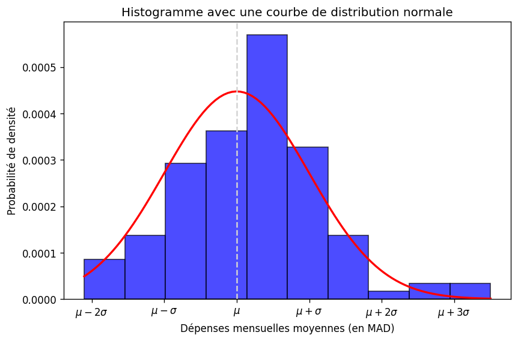

# Analyse des données - Généré le 27/04/2025 à 16:27

## Statistiques descriptives

### Qualité du sommeil  [QDS]

#### Dispersion des données

|                  | N   | Minimum | Maximum | Moyenne | Écart type |
| ---------------- | --- | ------- | ------- | ------- | ---------- |
| N Valide (liste) | 116 | 1       | 10      | 5.931   | 2.3096     |

> L'écart-type est relativement élevé, ce qui veut dire qu'il y a une grande dispersion des données

#### Distribution des données et test de normalité

<table>
    <tr>
        <th style='text-align: center;' colspan='3'>Kolmogrov-Smirnov</th><th style='text-align: center;' colspan='3'>Shapiro-Wilk</th>
    </tr>
    <tr>
        <th>Statistiques</th><th>ddl</th><th>Sig.</th><th>Statistiques</th><th>ddl</th><th>Sig.</th>
    </tr>
    <tr>
        <td>0.1093</td>
        <td>116</td>
        <td>0.1161</td>
        <td>0.9648</td>
        <td>116</td>
        <td>0.0039</td>
    </tr>
</table>

> Une distribution normale

### Nombre moyen d’heures de sommeil par nuit [NMDDSPN]

#### Dispersion des données

|                  | N   | Minimum | Maximum | Moyenne | Écart type |
| ---------------- | --- | ------- | ------- | ------- | ---------- |
| N Valide (liste) | 116 | 5.0     | 10.0    | 5.6121  | 1.1172     |

> L'écart-type est relativement faible, ce qui veut dire que les valeurs sont proches de la moyenne

#### Distribution des données et test de normalité

<table>
    <tr>
        <th style='text-align: center;' colspan='3'>Kolmogrov-Smirnov</th><th style='text-align: center;' colspan='3'>Shapiro-Wilk</th>
    </tr>
    <tr>
        <th>Statistiques</th><th>ddl</th><th>Sig.</th><th>Statistiques</th><th>ddl</th><th>Sig.</th>
    </tr>
    <tr>
        <td>0.4409</td>
        <td>116</td>
        <td>0.0</td>
        <td>0.5693</td>
        <td>116</td>
        <td>0.0</td>
    </tr>
</table>

> L'écart-type est relativement faible, ce qui veut dire que les valeurs sont proches de la moyenne

### Nombre d’heures de travail par semaine [NDDTPS]

#### Dispersion des données

|                  | N   | Minimum | Maximum | Moyenne | Écart type |
| ---------------- | --- | ------- | ------- | ------- | ---------- |
| N Valide (liste) | 116 | 0       | 20      | 7.2414  | 5.6854     |

> L'écart-type est relativement élevé, ce qui veut dire qu'il y a une grande dispersion des données

#### Distribution des données et test de normalité

<table>
    <tr>
        <th style='text-align: center;' colspan='3'>Kolmogrov-Smirnov</th><th style='text-align: center;' colspan='3'>Shapiro-Wilk</th>
    </tr>
    <tr>
        <th>Statistiques</th><th>ddl</th><th>Sig.</th><th>Statistiques</th><th>ddl</th><th>Sig.</th>
    </tr>
    <tr>
        <td>0.35</td>
        <td>116</td>
        <td>0.0</td>
        <td>0.7327</td>
        <td>116</td>
        <td>0.0</td>
    </tr>
</table>

> L'écart-type est relativement élevé, ce qui veut dire qu'il y a une grande dispersion des données

### •Combien de fois vous voyager ( entre Dakhla et votre Ville ) par ans [CDFVVPA]

#### Dispersion des données

|                  | N   | Minimum | Maximum | Moyenne | Écart type |
| ---------------- | --- | ------- | ------- | ------- | ---------- |
| N Valide (liste) | 116 | 0       | 6       | 3.069   | 1.6977     |

> L'écart-type est relativement élevé, ce qui veut dire qu'il y a une grande dispersion des données

#### Distribution des données et test de normalité

<table>
    <tr>
        <th style='text-align: center;' colspan='3'>Kolmogrov-Smirnov</th><th style='text-align: center;' colspan='3'>Shapiro-Wilk</th>
    </tr>
    <tr>
        <th>Statistiques</th><th>ddl</th><th>Sig.</th><th>Statistiques</th><th>ddl</th><th>Sig.</th>
    </tr>
    <tr>
        <td>0.2786</td>
        <td>116</td>
        <td>0.0</td>
        <td>0.8623</td>
        <td>116</td>
        <td>0.0</td>
    </tr>
</table>

> L'écart-type est relativement élevé, ce qui veut dire qu'il y a une grande dispersion des données

### capacité à économiser par moins ( MAD) [CAEPM]

#### Dispersion des données

|                  | N   | Minimum | Maximum | Moyenne  | Écart type |
| ---------------- | --- | ------- | ------- | -------- | ---------- |
| N Valide (liste) | 116 | 0       | 1000    | 362.6724 | 274.6582   |

> L'écart-type est relativement élevé, ce qui veut dire qu'il y a une grande dispersion des données

#### Distribution des données et test de normalité

<table>
    <tr>
        <th style='text-align: center;' colspan='3'>Kolmogrov-Smirnov</th><th style='text-align: center;' colspan='3'>Shapiro-Wilk</th>
    </tr>
    <tr>
        <th>Statistiques</th><th>ddl</th><th>Sig.</th><th>Statistiques</th><th>ddl</th><th>Sig.</th>
    </tr>
    <tr>
        <td>0.2604</td>
        <td>116</td>
        <td>0.0</td>
        <td>0.8356</td>
        <td>116</td>
        <td>0.0</td>
    </tr>
</table>

> L'écart-type est relativement élevé, ce qui veut dire qu'il y a une grande dispersion des données

### Dépenses mensuelles moyennes (en MAD) [DMM]

#### Dispersion des données

|                  | N   | Minimum | Maximum | Moyenne   | Écart type |
| ---------------- | --- | ------- | ------- | --------- | ---------- |
| N Valide (liste) | 116 | 0.0     | 5000.0  | 1876.7241 | 891.9308   |

> L'écart-type est relativement élevé, ce qui veut dire qu'il y a une grande dispersion des données

#### Distribution des données et test de normalité

<table>
    <tr>
        <th style='text-align: center;' colspan='3'>Kolmogrov-Smirnov</th><th style='text-align: center;' colspan='3'>Shapiro-Wilk</th>
    </tr>
    <tr>
        <th>Statistiques</th><th>ddl</th><th>Sig.</th><th>Statistiques</th><th>ddl</th><th>Sig.</th>
    </tr>
    <tr>
        <td>0.1217</td>
        <td>116</td>
        <td>0.0592</td>
        <td>0.9494</td>
        <td>116</td>
        <td>0.0003</td>
    </tr>
</table>

> Une distribution normale

### Nombre de formations en ligne suivies cette année [NDFELSCA]

#### Dispersion des données

|                  | N   | Minimum | Maximum | Moyenne | Écart type |
| ---------------- | --- | ------- | ------- | ------- | ---------- |
| N Valide (liste) | 116 | 0       | 10      | 0.8534  | 1.5784     |

> L'écart-type est relativement élevé, ce qui veut dire qu'il y a une grande dispersion des données

#### Distribution des données et test de normalité

<table>
    <tr>
        <th style='text-align: center;' colspan='3'>Kolmogrov-Smirnov</th><th style='text-align: center;' colspan='3'>Shapiro-Wilk</th>
    </tr>
    <tr>
        <th>Statistiques</th><th>ddl</th><th>Sig.</th><th>Statistiques</th><th>ddl</th><th>Sig.</th>
    </tr>
    <tr>
        <td>0.3091</td>
        <td>116</td>
        <td>0.0</td>
        <td>0.5762</td>
        <td>116</td>
        <td>0.0</td>
    </tr>
</table>

> L'écart-type est relativement élevé, ce qui veut dire qu'il y a une grande dispersion des données

### Nombre d'heures d'étude par semaine  [NDDPS]

#### Dispersion des données

|                  | N   | Minimum | Maximum | Moyenne | Écart type |
| ---------------- | --- | ------- | ------- | ------- | ---------- |
| N Valide (liste) | 116 | 2       | 32      | 16.5431 | 6.8365     |

> L'écart-type est relativement élevé, ce qui veut dire qu'il y a une grande dispersion des données

#### Distribution des données et test de normalité

<table>
    <tr>
        <th style='text-align: center;' colspan='3'>Kolmogrov-Smirnov</th><th style='text-align: center;' colspan='3'>Shapiro-Wilk</th>
    </tr>
    <tr>
        <th>Statistiques</th><th>ddl</th><th>Sig.</th><th>Statistiques</th><th>ddl</th><th>Sig.</th>
    </tr>
    <tr>
        <td>0.2193</td>
        <td>116</td>
        <td>0.0</td>
        <td>0.9069</td>
        <td>116</td>
        <td>0.0</td>
    </tr>
</table>

> L'écart-type est relativement élevé, ce qui veut dire qu'il y a une grande dispersion des données

### Âge [AGE]

#### Dispersion des données

|                  | N   | Minimum | Maximum | Moyenne | Écart type |
| ---------------- | --- | ------- | ------- | ------- | ---------- |
| N Valide (liste) | 116 | 19      | 27      | 20.4052 | 0.9229     |

> L'écart-type est relativement faible, ce qui veut dire que les valeurs sont proches de la moyenne

#### Distribution des données et test de normalité

<table>
    <tr>
        <th style='text-align: center;' colspan='3'>Kolmogrov-Smirnov</th><th style='text-align: center;' colspan='3'>Shapiro-Wilk</th>
    </tr>
    <tr>
        <th>Statistiques</th><th>ddl</th><th>Sig.</th><th>Statistiques</th><th>ddl</th><th>Sig.</th>
    </tr>
    <tr>
        <td>0.3076</td>
        <td>116</td>
        <td>0.0</td>
        <td>0.648</td>
        <td>116</td>
        <td>0.0</td>
    </tr>
</table>

> L'écart-type est relativement faible, ce qui veut dire que les valeurs sont proches de la moyenne

### Année d’obtention du Bac [ADDB]

#### Dispersion des données

|                  | N   | Minimum | Maximum | Moyenne | Écart type |
| ---------------- | --- | ------- | ------- | ------- | ---------- |
| N Valide (liste) | 116 | 2021    | 2022    | 2021.75 | 0.4349     |

> L'écart-type est relativement faible, ce qui veut dire que les valeurs sont proches de la moyenne

#### Distribution des données et test de normalité

<table>
    <tr>
        <th style='text-align: center;' colspan='3'>Kolmogrov-Smirnov</th><th style='text-align: center;' colspan='3'>Shapiro-Wilk</th>
    </tr>
    <tr>
        <th>Statistiques</th><th>ddl</th><th>Sig.</th><th>Statistiques</th><th>ddl</th><th>Sig.</th>
    </tr>
    <tr>
        <td>0.4673</td>
        <td>116</td>
        <td>0.0</td>
        <td>0.5383</td>
        <td>116</td>
        <td>0.0</td>
    </tr>
</table>

> L'écart-type est relativement faible, ce qui veut dire que les valeurs sont proches de la moyenne

### Genre [GENRE] -> Filière d’étude [FD]

#### Tableau de contingence (croisé)

| Éléments | COMMERCE | GESTION | TOTAL |
| -------- | -------- | ------- | ----- |
| FEMALE   | 22       | 59      | 81    |
| MALE     | 13       | 22      | 35    |
| TOTAL    | 35       | 81      | 116   |

#### Tableau du Khi-Carré (χ²)

|                          | Valeur | dll | Sig.  |
| ------------------------ | ------ | --- | ----- |
| Khi-Carré de Pearson     | 0.718  | 1   | 0.397 |
| Rapport de vraisemblance |        | 1   |       |
| N d'observations valides | 116    |     |       |

Le test du Khi-deux de Pearson indique une association __non significative__ entre genre et filière d’étude

### Option    Bac [OB] -> Filière d’étude [FD]

#### Tableau de contingence (croisé)

| Éléments | COMMERCE | GESTION | TOTAL |
| -------- | -------- | ------- | ----- |
| MATH     | 6        | 9       | 15    |
| EXP      | 6        | 20      | 26    |
| ECO      | 23       | 52      | 75    |
| TOTAL    | 35       | 81      | 116   |

#### Tableau du Khi-Carré (χ²)

|                          | Valeur | dll | Sig.  |
| ------------------------ | ------ | --- | ----- |
| Khi-Carré de Pearson     | 1.316  | 2   | 0.518 |
| Rapport de vraisemblance |        | 2   |       |
| N d'observations valides | 116    |     |       |

Le test du Khi-deux de Pearson indique une association __non significative__ entre option bac et filière d’étude

### Fréquence d’utilisation des réseaux sociaux par jour [FDDRSPJ] -> Temps passé sur les écrans par jour  [TPSLEPJ]

#### Tableau de contingence (croisé)

| Éléments | 5H ET PLUS | 3-5H | 1-3H | MOINS DE 1H | TOTAL |
| -------- | ---------- | ---- | ---- | ----------- | ----- |
| 7 ET +   | 19         | 11   | 2    | 0           | 32    |
| 4-6      | 16         | 16   | 10   | 0           | 42    |
| 1-3      | 6          | 20   | 12   | 2           | 40    |
| 1        | 0          | 1    | 0    | 1           | 2     |
| TOTAL    | 41         | 48   | 24   | 3           | 116   |

#### Tableau du Khi-Carré (χ²)

|                          | Valeur | dll | Sig.  |
| ------------------------ | ------ | --- | ----- |
| Khi-Carré de Pearson     | 28.545 | 9   | 0.001 |
| Rapport de vraisemblance |        | 9   |       |
| N d'observations valides | 116    |     |       |

Le test du Khi-deux de Pearson indique une association __statistiquement significative__ entre fréquence d’utilisation des réseaux sociaux par jour et temps passé sur les écrans par jour Attention : Les conditions d'application du test ne sont pas pleinement respectées (plus de 20% des effectifs théoriques < 5 ou effectif minimum < 1). Les résultats doivent être interprétés avec prudence.

### Type de logement ( à Dakhla ) [TDL] -> Source principale de revenu [SPDR]

#### Tableau de contingence (croisé)

| Éléments    | AIDE FAMILIALE | BOURSE | TRAVAIL | PARENTS | TOTAL |
| ----------- | -------------- | ------ | ------- | ------- | ----- |
| APPARTEMENT | 48             | 22     | 5       | 0       | 75    |
| CHAMBRE     | 24             | 7      | 1       | 0       | 32    |
| FAMILLE     | 2              | 1      | 0       | 0       | 3     |
| MAISON      | 2              | 2      | 1       | 0       | 5     |
| MINI VILLA  | 0              | 0      | 0       | 0       | 0     |
| TOTAL       | 76             | 32     | 7       | 0       | 115   |

#### Tableau du Khi-Carré (χ²)

|                          | Valeur | dll | Sig.  |
| ------------------------ | ------ | --- | ----- |
| Khi-Carré de Pearson     | 3.739  | 6   | 0.712 |
| Rapport de vraisemblance |        | 6   |       |
| N d'observations valides | 115    |     |       |

Le test du Khi-deux de Pearson indique une association __non significative__ entre type de logement ( à dakhla ) et source principale de revenuAttention : Les conditions d'application du test ne sont pas pleinement respectées (plus de 20% des effectifs théoriques < 5 ou effectif minimum < 1). Les résultats doivent être interprétés avec prudence.

### Type d’application la plus utilisée  [TDLPU] -> Temps passé sur les écrans par jour  [TPSLEPJ]

#### Tableau de contingence (croisé)

| Éléments        | 5H ET PLUS | 3-5H | 1-3H | MOINS DE 1H | TOTAL |
| --------------- | ---------- | ---- | ---- | ----------- | ----- |
| RESEAUX SOCIAUX | 32         | 31   | 20   | 3           | 86    |
| BUREAUTIQUE     | 1          | 7    | 0    | 0           | 8     |
| JEUX VIDEO      | 7          | 5    | 1    | 0           | 13    |
| STREAMING       | 1          | 5    | 3    | 0           | 9     |
| YOUTUBE         | 0          | 0    | 0    | 0           | 0     |
| LES SERIES      | 0          | 0    | 0    | 0           | 0     |
| TOTAL           | 41         | 48   | 24   | 3           | 116   |

#### Tableau du Khi-Carré (χ²)

|                          | Valeur | dll | Sig.  |
| ------------------------ | ------ | --- | ----- |
| Khi-Carré de Pearson     | 16.290 | 9   | 0.061 |
| Rapport de vraisemblance |        | 9   |       |
| N d'observations valides | 116    |     |       |

Le test du Khi-deux de Pearson indique une association __non significative__ entre type d’application la plus utilisée et temps passé sur les écrans par jour Attention : Les conditions d'application du test ne sont pas pleinement respectées (plus de 20% des effectifs théoriques < 5 ou effectif minimum < 1). Les résultats doivent être interprétés avec prudence.

## Analyse inférentielle

### Est-ce que la capacité moyenne à économiser par mois est différente de 300 DH (Valeur théorique) ?

- H0 : Moyenne observée = valeur théorique (u = u0)
- H1 : Moyenne observée ≠ Valeur théorique (u != u0)

#### Statistiques sur échantillon uniques

|       | N   | Moyenne | Écart-type | Moyenne erreur standard |
| ----- | --- | ------- | ---------- | ----------------------- |
| CAEPM | 116 | 362.672 | 274.658    | 25.501                  |

#### Test sur échantillon unique (300)

|       | t     | dll | Sig. (bilatéral) | Différence moyenne | IDCD Inférieur | IDCD Supérieur |
| ----- | ----- | --- | ---------------- | ------------------ | -------------- | -------------- |
| CAEPM | 2.458 | 116 | 0.015            | 62.672             | 12.159         | 113.186        |

(*) IDCD : Intervalle de confiance de la différence à 95.0%

La moyenne __diffère significativement__ de la valeur théorique (p < 0.05)

### Y a-t'il une différence entre les dépenses mensuelles moyennes des garçons et filles ?

- H0 : Aucune différence/relation entre les deux groupes
- H1 : Une différence/relation existe entre les deux groupes

#### Statistiques de groupe

|     | GENRE  | N  | Moyenne  | Écart-type | Moyenne erreur standard |
| --- | ------ | -- | -------- | ---------- | ----------------------- |
| DMM | FEMALE | 81 | 1840.123 | 905.311    | 100.590                 |
|     | MALE   | 35 | 1961.429 | 867.051    | 146.558                 |

#### Test des échantillons indépendants

|     |                                 | F     | Sig.  | t      | dll   | Sig. (bilatéral) | Différence moyenne | Différence erreur standard | IDCD Inférieur | IDCD Supérieur |
| --- | ------------------------------- | ----- | ----- | ------ | ----- | ---------------- | ------------------ | -------------------------- | -------------- | -------------- |
| DMM | Hypothèse de variances égales   | 1.555 | 0.215 | -0.671 | 114.0 | 0.504            | -121.305           | 180.853                    | -479.573       | 236.963        |
|     | Hypothèse de variances inégales |       |       | -0.682 | 67.2  | 0.497            | -121.305           | 177.758                    | -476.088       | 233.477        |

Il n'y a pas de différence significative entre les dépenses mensuelles moyennes des garçons et filles

### Est-ce que le travail en parallèle des études influence le nombre d'heures d'étude par semaine ?

- H0 : Aucune différence/relation entre les deux groupes
- H1 : Une différence/relation existe entre les deux groupes

#### ANOVA à 1 facteur

|              | Somme des carrés | dll | Carré moyen | F     | Sig.  |
| ------------ | ---------------- | --- | ----------- | ----- | ----- |
| Intergroupes | 433.702          | 1   | 433.702     | 0.001 | 0.981 |
| Intragroupes | 91486721.470     | 114 | 802515.101  |       |       |
| Total        | 91487155.172     | 115 |             |       |       |

Résultat ANOVA: F(1,114) = 0.001, p = 0.981

Conclusion: Nous ne pouvons pas rejeter H0 (p ≥ 0.05). Aucune différence significative n'a été détectée.

### Est-ce que le genre a une association avec la participation aux projets académiques/professionnels ?

- H0 : Aucune association entre les deux variables
- H1 : Une association significative existe entre les deux variables catégorielles

### Genre [GENRE] -> Participation à des projets académiques/professionnels [PADPA]

#### Tableau de contingence (croisé)

| Éléments | NON | OUI | TOTAL |
| -------- | --- | --- | ----- |
| FEMALE   | 43  | 38  | 81    |
| MALE     | 15  | 20  | 35    |
| TOTAL    | 58  | 58  | 116   |

#### Tableau du Khi-Carré (χ²)

|                          | Valeur | dll | Sig.  |
| ------------------------ | ------ | --- | ----- |
| Khi-Carré de Pearson     | 0.656  | 1   | 0.418 |
| Rapport de vraisemblance |        | 1   |       |
| N d'observations valides | 116    |     |       |

Le test du Khi-deux de Pearson indique une association __non significative__ entre genre et participation à des projets académiques/professionnels