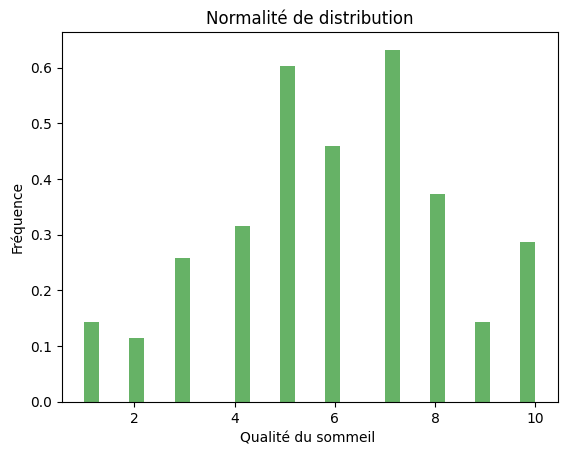

# Analyse des données - Généré le 20/04/2025 à 19:43

## Statistiques descriptives

### Qualité du sommeil  [QDS]

#### Dispersion des données

|                  | N   | Minimum | Maximum | Moyenne | Écart type |
| ---------------- | --- | ------- | ------- | ------- | ---------- |
| N Valide (liste) | 116 | 1       | 10      | 5.931   | 2.3096     |

> L'écart-type est relativement faible, ce qui veut dire que les valeurs sont proches de la moyenne

#### Distribution des données et test de normalité

<table>
    <tr>
        <th style='text-align: center;' colspan='3'>Kolmogrov-Smirnov</th><th style='text-align: center;' colspan='3'>Shapiro-Wilk</th>
    </tr>
    <tr>
        <th>Statistiques</th><th>ddl</th><th>Sig.</th><th>Statistiques</th><th>ddl</th><th>Sig.</th>
    </tr>
    <tr>
        <td>0.1093</td>
        <td>116</td>
        <td>0.1161</td>
        <td>0.9648</td>
        <td>116</td>
        <td>0.0039</td>
    </tr>
</table>

> Une distribution normale

### Nombre moyen d’heures de sommeil par nuit [NMDDSPN]

#### Dispersion des données

|                  | N   | Minimum | Maximum | Moyenne | Écart type |
| ---------------- | --- | ------- | ------- | ------- | ---------- |
| N Valide (liste) | 116 | 5.0     | 10.0    | 5.6552  | 1.1876     |

> L'écart-type est relativement faible, ce qui veut dire que les valeurs sont proches de la moyenne

#### Distribution des données et test de normalité

<table>
    <tr>
        <th style='text-align: center;' colspan='3'>Kolmogrov-Smirnov</th><th style='text-align: center;' colspan='3'>Shapiro-Wilk</th>
    </tr>
    <tr>
        <th>Statistiques</th><th>ddl</th><th>Sig.</th><th>Statistiques</th><th>ddl</th><th>Sig.</th>
    </tr>
    <tr>
        <td>0.4335</td>
        <td>116</td>
        <td>0.0</td>
        <td>0.5768</td>
        <td>116</td>
        <td>0.0</td>
    </tr>
</table>

> L'écart-type est relativement faible, ce qui veut dire que les valeurs sont proches de la moyenne

### Nombre d’heures de travail par semaine [NDDTPS]

#### Dispersion des données

|                  | N   | Minimum | Maximum | Moyenne | Écart type |
| ---------------- | --- | ------- | ------- | ------- | ---------- |
| N Valide (liste) | 116 | 0       | 20      | 7.2414  | 5.6854     |

> L'écart-type est relativement faible, ce qui veut dire que les valeurs sont proches de la moyenne

#### Distribution des données et test de normalité

<table>
    <tr>
        <th style='text-align: center;' colspan='3'>Kolmogrov-Smirnov</th><th style='text-align: center;' colspan='3'>Shapiro-Wilk</th>
    </tr>
    <tr>
        <th>Statistiques</th><th>ddl</th><th>Sig.</th><th>Statistiques</th><th>ddl</th><th>Sig.</th>
    </tr>
    <tr>
        <td>0.35</td>
        <td>116</td>
        <td>0.0</td>
        <td>0.7327</td>
        <td>116</td>
        <td>0.0</td>
    </tr>
</table>

> L'écart-type est relativement faible, ce qui veut dire que les valeurs sont proches de la moyenne

### •Combien de fois vous voyager ( entre Dakhla et votre Ville ) par ans [CDFVVPA]

#### Dispersion des données

|                  | N   | Minimum | Maximum | Moyenne | Écart type |
| ---------------- | --- | ------- | ------- | ------- | ---------- |
| N Valide (liste) | 116 | 0.0     | 6.0     | 3.0706  | 1.6977     |

> L'écart-type est relativement faible, ce qui veut dire que les valeurs sont proches de la moyenne

#### Distribution des données et test de normalité

<table>
    <tr>
        <th style='text-align: center;' colspan='3'>Kolmogrov-Smirnov</th><th style='text-align: center;' colspan='3'>Shapiro-Wilk</th>
    </tr>
    <tr>
        <th>Statistiques</th><th>ddl</th><th>Sig.</th><th>Statistiques</th><th>ddl</th><th>Sig.</th>
    </tr>
    <tr>
        <td>0.279</td>
        <td>116</td>
        <td>0.0</td>
        <td>0.8626</td>
        <td>116</td>
        <td>0.0</td>
    </tr>
</table>

> L'écart-type est relativement faible, ce qui veut dire que les valeurs sont proches de la moyenne

### capacité à économiser par moins ( MAD) [CAEPM]

#### Dispersion des données

|                  | N   | Minimum | Maximum | Moyenne  | Écart type |
| ---------------- | --- | ------- | ------- | -------- | ---------- |
| N Valide (liste) | 116 | 0       | 1000    | 362.6724 | 274.6582   |

> L'écart-type est relativement faible, ce qui veut dire que les valeurs sont proches de la moyenne

#### Distribution des données et test de normalité

<table>
    <tr>
        <th style='text-align: center;' colspan='3'>Kolmogrov-Smirnov</th><th style='text-align: center;' colspan='3'>Shapiro-Wilk</th>
    </tr>
    <tr>
        <th>Statistiques</th><th>ddl</th><th>Sig.</th><th>Statistiques</th><th>ddl</th><th>Sig.</th>
    </tr>
    <tr>
        <td>0.2604</td>
        <td>116</td>
        <td>0.0</td>
        <td>0.8356</td>
        <td>116</td>
        <td>0.0</td>
    </tr>
</table>

> L'écart-type est relativement faible, ce qui veut dire que les valeurs sont proches de la moyenne

### Dépenses mensuelles moyennes (en MAD) [DMM]

#### Dispersion des données

|                  | N   | Minimum | Maximum | Moyenne  | Écart type |
| ---------------- | --- | ------- | ------- | -------- | ---------- |
| N Valide (liste) | 116 | 0.0     | 40000.0 | 2287.069 | 3683.6072  |

> L'écart-type est relativement faible, ce qui veut dire que les valeurs sont proches de la moyenne

#### Distribution des données et test de normalité

<table>
    <tr>
        <th style='text-align: center;' colspan='3'>Kolmogrov-Smirnov</th><th style='text-align: center;' colspan='3'>Shapiro-Wilk</th>
    </tr>
    <tr>
        <th>Statistiques</th><th>ddl</th><th>Sig.</th><th>Statistiques</th><th>ddl</th><th>Sig.</th>
    </tr>
    <tr>
        <td>0.3543</td>
        <td>116</td>
        <td>0.0</td>
        <td>0.254</td>
        <td>116</td>
        <td>0.0</td>
    </tr>
</table>

> L'écart-type est relativement faible, ce qui veut dire que les valeurs sont proches de la moyenne

### Nombre de formations en ligne suivies cette année [NDFELSCA]

#### Dispersion des données

|                  | N   | Minimum | Maximum | Moyenne | Écart type |
| ---------------- | --- | ------- | ------- | ------- | ---------- |
| N Valide (liste) | 116 | 0       | 10      | 0.8534  | 1.5784     |

> L'écart-type est relativement faible, ce qui veut dire que les valeurs sont proches de la moyenne

#### Distribution des données et test de normalité

<table>
    <tr>
        <th style='text-align: center;' colspan='3'>Kolmogrov-Smirnov</th><th style='text-align: center;' colspan='3'>Shapiro-Wilk</th>
    </tr>
    <tr>
        <th>Statistiques</th><th>ddl</th><th>Sig.</th><th>Statistiques</th><th>ddl</th><th>Sig.</th>
    </tr>
    <tr>
        <td>0.3091</td>
        <td>116</td>
        <td>0.0</td>
        <td>0.5762</td>
        <td>116</td>
        <td>0.0</td>
    </tr>
</table>

> L'écart-type est relativement faible, ce qui veut dire que les valeurs sont proches de la moyenne

### Nombre d'heures d'étude par semaine  [NDDPS]

#### Dispersion des données

|                  | N   | Minimum | Maximum | Moyenne | Écart type |
| ---------------- | --- | ------- | ------- | ------- | ---------- |
| N Valide (liste) | 116 | 2.0     | 32.0    | 16.5102 | 6.8353     |

> L'écart-type est relativement faible, ce qui veut dire que les valeurs sont proches de la moyenne

#### Distribution des données et test de normalité

<table>
    <tr>
        <th style='text-align: center;' colspan='3'>Kolmogrov-Smirnov</th><th style='text-align: center;' colspan='3'>Shapiro-Wilk</th>
    </tr>
    <tr>
        <th>Statistiques</th><th>ddl</th><th>Sig.</th><th>Statistiques</th><th>ddl</th><th>Sig.</th>
    </tr>
    <tr>
        <td>0.221</td>
        <td>116</td>
        <td>0.0</td>
        <td>0.9086</td>
        <td>116</td>
        <td>0.0</td>
    </tr>
</table>

> L'écart-type est relativement faible, ce qui veut dire que les valeurs sont proches de la moyenne

### Âge [AGE]

#### Dispersion des données

|                  | N   | Minimum | Maximum | Moyenne | Écart type |
| ---------------- | --- | ------- | ------- | ------- | ---------- |
| N Valide (liste) | 116 | 19      | 27      | 20.4052 | 0.9229     |

> L'écart-type est relativement faible, ce qui veut dire que les valeurs sont proches de la moyenne

#### Distribution des données et test de normalité

<table>
    <tr>
        <th style='text-align: center;' colspan='3'>Kolmogrov-Smirnov</th><th style='text-align: center;' colspan='3'>Shapiro-Wilk</th>
    </tr>
    <tr>
        <th>Statistiques</th><th>ddl</th><th>Sig.</th><th>Statistiques</th><th>ddl</th><th>Sig.</th>
    </tr>
    <tr>
        <td>0.3076</td>
        <td>116</td>
        <td>0.0</td>
        <td>0.648</td>
        <td>116</td>
        <td>0.0</td>
    </tr>
</table>

> L'écart-type est relativement faible, ce qui veut dire que les valeurs sont proches de la moyenne

### Année d’obtention du Bac [ADDB]

#### Dispersion des données

|                  | N   | Minimum | Maximum | Moyenne | Écart type |
| ---------------- | --- | ------- | ------- | ------- | ---------- |
| N Valide (liste) | 116 | 2021    | 2022    | 2021.75 | 0.4349     |

> L'écart-type est relativement faible, ce qui veut dire que les valeurs sont proches de la moyenne

#### Distribution des données et test de normalité

<table>
    <tr>
        <th style='text-align: center;' colspan='3'>Kolmogrov-Smirnov</th><th style='text-align: center;' colspan='3'>Shapiro-Wilk</th>
    </tr>
    <tr>
        <th>Statistiques</th><th>ddl</th><th>Sig.</th><th>Statistiques</th><th>ddl</th><th>Sig.</th>
    </tr>
    <tr>
        <td>0.4673</td>
        <td>116</td>
        <td>0.0</td>
        <td>0.5383</td>
        <td>116</td>
        <td>0.0</td>
    </tr>
</table>

> L'écart-type est relativement faible, ce qui veut dire que les valeurs sont proches de la moyenne

### Genre [GENRE] -> Filière d’étude [FD]

#### Tableau de contingence (croisé)

|  | Sex    | COMMERCE | GESTION | Total |
|  | ------ | -------- | ------- | ----- |
|  | FEMALE | 22       | 59      | 81    |
|  | MALE   | 13       | 22      | 35    |
|  | Total  | 35       | 81      | 116   |

#### Tableau du Khi-Carré (χ²)

|                          | Valeur | dll | Sig.  |
| ------------------------ | ------ | --- | ----- |
| Khi-Carré de Pearson     | 0.731  | 1   | 0.393 |
| Rapport de vraisemblance |        | 1   |       |
| N d'observations valides | 116    |     |       |

a. 0 cellules (0.0%) ont un effectif théorique inférieur à 5. L'effectif théorique minimum est de 10.56.

Signification (p-value) = 0.393 Le test du Khi-deux de Pearson indique une association non significative entre les variables (p = 0.393).

## Analyse inférentielle